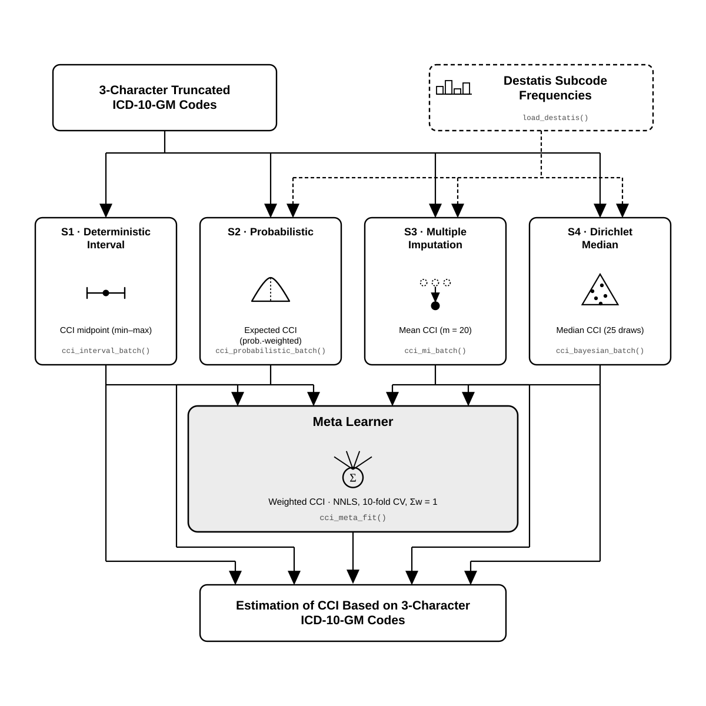

# miCCI

### Charlson Comorbidity Index Estimation From Truncated ICD-10-GM Codes

`miCCI` estimates the Charlson Comorbidity Index (CCI) when diagnosis codes have been shortened to three characters for privacy. It offers four estimation strategies and a meta learner that combines them. In addition, it computes the exact CCI whenever complete codes are available.

---

## Contents

1. [Rationale](#rationale)
2. [The Charlson Comorbidity Index](#the-charlson-comorbidity-index)
3. [Conceptual Overview](#conceptual-overview)
4. [Estimation Strategies](#estimation-strategies)
5. [Choosing a Configuration](#choosing-a-configuration)
6. [Requirements](#requirements)
7. [Installation](#installation)
8. [Loading](#loading)
9. [Testing](#testing)
10. [Input Format](#input-format)
11. [Quick Start](#quick-start)
12. [Full-Length Codes](#full-length-codes)
13. [Use Case A: Destatis, No Age](#use-case-a-destatis-no-age)
14. [Use Case B: Destatis, With Age](#use-case-b-destatis-with-age)
15. [Use Case C: Custom Frequencies, No Age](#use-case-c-custom-frequencies-no-age)
16. [Use Case D: Custom Frequencies, With Age](#use-case-d-custom-frequencies-with-age)
17. [Meta Learner](#meta-learner)
18. [Function Reference](#function-reference)
19. [Reproducibility](#reproducibility)
20. [Implementation Notes](#implementation-notes)
21. [Citation](#citation)
22. [License](#license)

---

## Rationale

Data holders often share diagnoses only at the three-character level. Thus `E11.40` becomes `E11`, and `N18.4` becomes `N18`. However, the CCI depends on exactly the characters that were removed. For example, `E11.9` (diabetes without complications) scores 1 point, whereas `E11.4` (diabetes with complications) scores 2. After truncation, both appear as `E11`.

The subcodes behind a prefix are not equally likely, though. National statistics record how often each four-character code occurs, and these frequencies also shift with age. `miCCI` uses this information to estimate the CCI from the truncated prefix alone.

The bundled ICD-10-GM to Charlson mapping (`inst/extdata/codes_quan_orig.json`) follows the German adaptation of the Quan et al. (2005) algorithm by Sokołowski et al. (2026). Both references are listed under [Citation](#citation).

## The Charlson Comorbidity Index

The CCI sums fixed weights over 17 comorbidity groups. Moreover, three severe groups suppress their milder counterpart when both are present, so a patient never scores twice for the same condition.

| Group key | Condition | Weight | Suppressed by |
|---|---|---|---|
| `malignancy_meta` | Metastatic malignancy | 6 | none |
| `aids` | AIDS | 6 | none |
| `liver_severe` | Severe liver disease | 3 | none |
| `dm_complicated` | Diabetes with end-organ complications | 2 | none |
| `kidney` | Kidney disease | 2 | none |
| `malignancy_nonmeta` | Non-metastatic malignancy | 2 | `malignancy_meta` |
| `plegia` | Plegia or paralysis | 2 | none |
| `liver_mild` | Mild liver disease | 1 | `liver_severe` |
| `dm_simple` | Diabetes without complications | 1 | `dm_complicated` |
| `mi` | Myocardial infarction | 1 | none |
| `hf` | Heart failure | 1 | none |
| `cerebrovascular` | Cerebrovascular disease | 1 | none |
| `pulmo` | Chronic pulmonary disease | 1 | none |
| `rheumatic` | Rheumatic disease | 1 | none |
| `dementia` | Dementia | 1 | none |
| `peptic_ulcer` | Peptic ulcer disease | 1 | none |
| `peripheral_vascular` | Peripheral vascular disease | 1 | none |

## Conceptual Overview



Two inputs enter at the top. The first is the set of 3-character truncated codes. The second is a table of subcode frequencies, Destatis by default or your own. S1 needs only to know which subcodes exist under each prefix. By contrast, S2, S3, and S4 also need to know how likely each subcode is, hence the dashed arrows. Each strategy then yields its own CCI estimate from the 3-character codes, and any one of them can be used on its own. The meta learner adds a fifth option: it combines S1 to S4 with non-negative weights that sum to one and are chosen by 10-fold cross-validation. All five paths therefore land on a CCI estimate for the same 3-character codes.

## Estimation Strategies

| Strategy | Principle | Output | Randomness |
|---|---|---|---|
| **S1** Interval | Lowest CCI counts only groups that every subcode triggers. Highest CCI counts groups that any subcode could trigger. | Minimum, maximum, midpoint | None |
| **S2** Probabilistic | Weights each subcode by its frequency and computes the expected CCI exactly, with inclusion-exclusion for overlapping groups. | Expected CCI | None |
| **S3** Multiple Imputation | Draws a complete subcode per prefix `m` times, scores each draw, and averages. | Mean of `m` draws | Seeded |
| **S4** Bayesian | Draws subcode probabilities from a Dirichlet prior centered on the frequencies, then samples and scores. | Posterior median | Seeded |
| **Meta** | Combines S1 to S4 with cross-validated non-negative least squares. | Weighted CCI | Seeded |

In practice, S1 gives a guaranteed range, and S2 gives a fast point estimate. S3 and S4 mimic plausible coding. The meta learner, in turn, needs a set of encounters with complete codes to learn its weights (see [Meta Learner](#meta-learner)).

## Choosing a Configuration

Two independent choices define every run.

| | **No age available** | **Age available** |
|---|---|---|
| **Destatis frequencies (default)** | [Use Case A](#use-case-a-destatis-no-age) | [Use Case B](#use-case-b-destatis-with-age) |
| **Your own frequencies** | [Use Case C](#use-case-c-custom-frequencies-no-age) | [Use Case D](#use-case-d-custom-frequencies-with-age) |

Age refines the subcode probabilities to the patient's age band. If age is missing for a patient, that patient falls back to the age-aggregated frequencies automatically. Similarly, your own frequency table can replace Destatis anywhere, for instance when working outside Germany or with a local reference population.

## Requirements

- **R ≥ 4.1.0.** The package was developed with R 4.6.0.
- **Required:** `data.table`, `jsonlite`.
- **Optional:**

  | Package | Needed for |
  |---|---|
  | `readxl` | `load_destatis()` |
  | `SuperLearner` | `cci_meta_fit()` |
  | `testthat (>= 3.0.0)` | Running the tests |

S1 to S4 and exact scoring run with the two required packages alone.

## Installation

```r
# install.packages("remotes")
remotes::install_github("gaetankamdje-wabo/miCCI")

# Or from a local copy:
remotes::install_local("path/to/miCCI")

# Optional packages:
install.packages(c("readxl", "SuperLearner"))
```

## Loading

```r
library(miCCI)

quan_map <- load_quan_map()
length(quan_map)
#> [1] 17
```

A result of `17` confirms that the package and its Charlson mapping loaded correctly.

## Testing

```r
# From the package source folder:
testthat::test_dir("tests/testthat")
```

All tests should pass. On systems without a UTF-8 locale, R may warn that it cannot translate `'95 u. älter'`, which is one of the German Destatis age-band labels. These warnings do not affect results. To silence them, set a UTF-8 locale first:

```r
Sys.setlocale("LC_ALL", "en_US.UTF-8")   # Linux alternative: "C.UTF-8"
```

## Input Format

**Diagnoses.** Single-encounter functions take a character vector, such as `c("E11", "N18")`. Batch functions take a `data.table` with a column `diagnosen` that holds one pipe-separated string per encounter, such as `"E11|N18|I10"`. Codes may be dotted or undotted, truncated or complete. Additional columns are ignored, and output keeps the row order.

**Frequencies.** A reference table needs four columns, and age bands are optional.

| Column | Type | Example |
|---|---|---|
| `code` | character | `"E11.4"` |
| `code_nodot` | character | `"E114"` |
| `code3` | character | `"E11"` |
| `freq_total` | numeric | `4433` |
| 22 age-band columns (optional) | numeric | See [Use Case D](#use-case-d-custom-frequencies-with-age) |

## Quick Start

```r
library(miCCI)

quan_map <- load_quan_map()                    # Charlson mapping
freq     <- load_destatis()                    # Destatis 23131-01, downloaded once per session
cache    <- precompute_lookups(freq, quan_map) # One-time preparation

codes <- c("E11", "N18", "I10")                # Truncated: diabetes, kidney disease, hypertension

cci_interval(codes, quan_map, cache)                      # S1
# Returns a list: cci_min = 2, cci_max = 4, cci_mid = 3, interval_width = 2

cci_probabilistic(codes, quan_map, cache)$e_cci           # S2
#> [1] 3.586574

cci_mi(codes, quan_map, cache, m = 20L, seed = 42L)$mi_cci  # S3
#> [1] 3.6

cci_bayesian(codes, quan_map, cache,
             n_draws = 25L, alpha_0 = 10, seed = 42L)$posterior_median  # S4
#> [1] 4
```

The true CCI therefore lies between 2 and 4, and the point estimates fall inside that range. Note that S2 to S4 values reflect the Destatis release you download, so a newer release may shift them slightly.

## Full-Length Codes

When codes are complete, no estimation is needed. The CCI is then exact and requires neither frequencies nor age.

```r
cci_gold(c("E11.40", "N18.4", "I10.00"), quan_map)
#> $cci
#> [1] 4
#> $active
#>         kidney dm_complicated
#>              2              2
```

For many encounters, `cci_gold_batch()` is much faster than looping:

```r
cohort <- data.table::data.table(
  id        = 1:3,
  diagnosen = c("E11.4|N18.4|I10.0",   # diabetes with complications + kidney disease
                "K70.4|K74.6",         # severe liver disease suppresses mild
                "C34.1|C78.0")         # metastasis suppresses primary tumor
)
cci_gold_batch(cohort, quan_map)
#> [1] 4 3 6
```

## Use Case A: Destatis, No Age

This is the default. Every strategy uses the national, age-aggregated frequencies.

```r
library(data.table)

freq     <- load_destatis()
quan_map <- load_quan_map()
cache    <- precompute_lookups(freq, quan_map)

dt <- data.table(
  id        = 1:5,
  diagnosen = c("E11|N18|I10", "K70|K74", "C34|C78", "I10|E78", "B20")
)

cci_interval_batch(dt, quan_map, cache)
#>    cci_min cci_max cci_mid interval_width
#> 1:       2       4       3              2
#> 2:       1       3       2              2
#> 3:       6       6       6              0
#> 4:       0       0       0              0
#> 5:       6       6       6              0

cci_probabilistic_batch(dt, quan_map, cache)
#> [1] 3.5866 1.0976 6.0000 0.0000 6.0000

cci_mi_batch(dt, quan_map, cache, m = 20L, seed = 42L)
#> [1] 3.55 1.00 6.00 0.00 6.00

cci_bayesian_batch(dt, quan_map, cache, n_draws = 25L, alpha_0 = 10, seed = 42L)
#> [1] 3 1 6 0 6
```

Row 5 (`B20`, AIDS) scores the full weight of 6 under every strategy. Destatis lists no subcodes for this prefix, so the prefix stands for itself (see [Implementation Notes](#implementation-notes)).

## Use Case B: Destatis, With Age

Here, age shifts the subcode probabilities toward the patient's age band. For a single encounter, pass `age` directly:

```r
cci_probabilistic("E11", quan_map, cache)$e_cci             # no age
#> [1] 1.5866
cci_probabilistic("E11", quan_map, cache, age = 35)$e_cci   # 35 years
#> [1] 1.2328
cci_probabilistic("E11", quan_map, cache, age = 78)$e_cci   # 78 years
#> [1] 1.6474
```

The estimate rises with age because complicated diabetes becomes more frequent. `prefix_pool()` shows the underlying shift:

```r
prefix_pool("E11", cache, age_idx = age_to_bin_index(35))  # E11.9 (uncomplicated) leads with 0.565
prefix_pool("E11", cache, age_idx = age_to_bin_index(78))  # E11.7 (complicated) leads with 0.530
```

For batches, convert ages once with `age_to_bin_index()` and pass the result as `age_idx`:

```r
dt <- data.table(
  diagnosen = c("E11|N18|I10", "K70|K74", "E11"),
  age       = c(35, 78, NA)
)
cci_probabilistic_batch(dt, quan_map, cache, age_idx = age_to_bin_index(dt$age))
#> [1] 3.2328 1.0693 1.5866
```

The third patient has no age and therefore receives the age-aggregated value. The same `age` and `age_idx` arguments work for `cci_mi*()` and `cci_bayesian*()`.

## Use Case C: Custom Frequencies, No Age

Replace `load_destatis()` with any table that has the four required columns. The strategies then use your frequencies instead.

```r
library(data.table)

my_freq <- data.table(
  code       = c("E11.4", "E11.9", "N18.4", "I10.0"),
  code_nodot = c("E114",  "E119",  "N184",  "I100"),
  code3      = c("E11",   "E11",   "N18",   "I10"),
  freq_total = c(3000,    7000,    45678,   789012)
)

cache_c <- precompute_lookups(my_freq, quan_map)

cci_interval(c("E11", "N18", "I10"), quan_map, cache_c)
# Returns a list: cci_min = 2, cci_max = 4, cci_mid = 3, interval_width = 2
cci_probabilistic(c("E11", "N18", "I10"), quan_map, cache_c)$e_cci
#> [1] 3.3
```

Under these frequencies, `E11` is complicated 30% of the time. The expected score is therefore 2 (kidney) plus 0.3 × 2 plus 0.7 × 1, which equals 3.3.

## Use Case D: Custom Frequencies, With Age

Add the 22 Destatis age-band columns to your table, and age conditioning switches on automatically. The exact column names are available as follows:

```r
miCCI:::.MICCI_AGE_BANDS
#>  [1] "unter 1" "1 - 5"   "5 - 10"  "10 - 15" "15-18"   "18-20"   "20 - 25"
#>  [8] "25 - 30" "30 - 35" "35 - 40" "40 - 45" "45 - 50" "50 - 55" "55 - 60"
#> [15] "60 - 65" "65 - 70" "70 - 75" "75 - 80" "80 - 85" "85 - 90" "90 - 95"
#> [22] "95 u. älter"
```

In the example below, complicated diabetes dominates at age 70 to 75, whereas uncomplicated diabetes dominates at age 45 to 50.

```r
library(data.table)

bands <- miCCI:::.MICCI_AGE_BANDS
make_row <- function(code, total, counts) {
  ages <- as.list(setNames(rep(0, length(bands)), bands))
  ages[names(counts)] <- counts
  data.table(code = code, code_nodot = sub(".", "", code, fixed = TRUE),
             code3 = substr(code, 1, 3), freq_total = total, as.data.table(ages))
}

freq_age <- rbind(
  make_row("E11.4", 1000, list("45 - 50" = 10,  "70 - 75" = 990)),
  make_row("E11.9", 1000, list("45 - 50" = 990, "70 - 75" = 10))
)

cache_d <- precompute_lookups(freq_age, quan_map)

cci_probabilistic("E11", quan_map, cache_d)$e_cci             # no age
#> [1] 1.5
cci_probabilistic("E11", quan_map, cache_d, age = 47)$e_cci   # band "45 - 50"
#> [1] 1.01
cci_probabilistic("E11", quan_map, cache_d, age = 72)$e_cci   # band "70 - 75"
#> [1] 1.99
```

Bands without any record for a prefix fall back to the age-aggregated frequencies, so sparse tables remain safe to use.

## Meta Learner

The meta learner learns how much to trust each strategy. For this, it needs encounters where both the complete codes and their truncated form are known. A typical workflow therefore has two steps: fit the weights on a calibration set, then apply them to truncated data.

**Step 1: fit on a calibration set.** Take encounters with complete codes, truncate them yourself, and run all strategies on the truncated version.

```r
library(data.table)

# calib$diagnosen holds complete codes, for example "E11.40|N18.4|I10.00"
trunc <- data.table(diagnosen = vapply(
  strsplit(calib$diagnosen, "|", fixed = TRUE),
  function(x) paste(substr(gsub(".", "", x, fixed = TRUE), 1, 3), collapse = "|"),
  character(1)))

s1 <- cci_interval_batch(trunc, quan_map, cache)
train <- data.table(
  cci_gold = cci_gold_batch(calib, quan_map),
  s1_min   = s1$cci_min, s1_max = s1$cci_max, s1_mid = s1$cci_mid,
  s2_ecci  = cci_probabilistic_batch(trunc, quan_map, cache),
  s3_mi    = cci_mi_batch(trunc, quan_map, cache, m = 20L, seed = 42L),
  s4_bayes = cci_bayesian_batch(trunc, quan_map, cache, n_draws = 25L, seed = 42L)
)

meta <- cci_meta_fit(train, V = 10L, seed = 42L)
meta$weights   # one non-negative weight per strategy, summing to 1
meta$cv_risk   # cross-validated error per strategy, lower is better
```

**Step 2: apply to truncated data.** The meta estimate is simply the weighted sum of the four strategy outputs:

```r
s1_new <- cci_interval_batch(new_dt, quan_map, cache)
X <- cbind(s1_new$cci_mid,
           cci_probabilistic_batch(new_dt, quan_map, cache),
           cci_mi_batch(new_dt, quan_map, cache, m = 20L, seed = 42L),
           cci_bayesian_batch(new_dt, quan_map, cache, n_draws = 25L, seed = 42L))

new_dt[, cci_meta := as.vector(X %*% meta$weights)]
```

Weights depend on the calibration data. Hence, the calibration set should resemble the population you want to score. If no calibration set exists, use S2 or S3 directly.

## Function Reference

Throughout, `quan_map` is the output of `load_quan_map()`, and `cache` is the output of `precompute_lookups()`.

### Charlson Mapping

| Function | Purpose | Returns |
|---|---|---|
| `load_quan_map(path = NULL)` | Loads the bundled mapping. Alternatively, `path` points to your own JSON file with the same structure. | Named list of 17 groups |
| `cci_gold(icd_codes, quan_map)` | Exact CCI for one encounter with complete codes | `list(cci, active)` |
| `cci_gold_batch(dt, quan_map)` | Exact CCI for every row of `dt` | Integer vector |

### Reference Data

| Function | Purpose | Returns |
|---|---|---|
| `load_destatis(url, cache = TRUE, force = FALSE, quiet = TRUE)` | Downloads Destatis 23131-01 and caches it for the session. `force = TRUE` reloads it, for example after a new annual release. | `data.table` with 4 key columns and 22 age bands |
| `precompute_lookups(freq_table, quan_map)` | Prepares the per-prefix lookups. Run once per frequency table, then reuse. | Environment (`cache`) |
| `prefix_pool(prefix_3char, cache, age_idx = NULL)` | Lists possible subcodes and their probabilities for one prefix. Useful for inspection. | `data.table(code_nodot, prob)` |
| `age_to_bin_index(age)` | Converts ages to Destatis band indices, with `NA` for missing values | Integer vector |

`age_to_bin_index(c(0.5, 35, 47, 78, 95, NA))` returns `1 10 12 18 22 NA`.

### Strategies

Each strategy exists in a single-encounter form and a `_batch` form. Both give identical results, although the batch form is faster for many encounters. Single forms accept `age`, whereas batch forms accept `age_idx`.

| Function | Key arguments | Returns |
|---|---|---|
| `cci_interval()` / `cci_interval_batch()` | none | `cci_min`, `cci_max`, `cci_mid`, `interval_width` |
| `cci_probabilistic()` / `cci_probabilistic_batch()` | `age` / `age_idx` | `e_cci` (single: list element) |
| `cci_mi()` / `cci_mi_batch()` | `m = 20`, `seed = 42`, `age` / `age_idx` | `mi_cci` (single: list element) |
| `cci_bayesian()` / `cci_bayesian_batch()` | `n_draws = 25`, `alpha_0 = 10`, `seed = 42`, `age` / `age_idx` | `posterior_median` (single: list element) |

Further options:

- `preserve_multiplicity = TRUE` (S2 to S4) treats a prefix coded twice as two diagnoses. Set it to `FALSE` to count repeated prefixes once.
- `alpha_0` (S4) sets the prior strength. Larger values bring S4 closer to S3, while smaller values widen the spread.
- `aggregator = "mean"` (S4) returns the posterior mean instead of the median.
- `return_group_prob = TRUE` (S1, S2) additionally returns the probability of each Charlson group per encounter.

### Meta Learner

| Function | Purpose | Returns |
|---|---|---|
| `cci_meta_fit(dt, V = 10L, seed = 42L)` | Fits the weights. `dt` needs `cci_gold`, `s1_min`, `s1_max`, `s1_mid`, `s2_ecci`, `s3_mi`, and `s4_bayes`. It requires `SuperLearner`. | `predictions`, `weights`, `cv_risk`, `sl_fit` |

## Reproducibility

All random functions (`cci_mi*`, `cci_bayesian*`, `cci_meta_fit`) take a `seed`. Consequently, the same seed always gives the same result. Moreover, each call restores your global random state afterward, so `miCCI` never disturbs a surrounding simulation.

## Implementation Notes

**Prefixes without subcodes count fully.** Some prefixes, such as the AIDS codes `B20` to `B24`, have no subcodes in Destatis. Rather than scoring zero, such a prefix stands for itself with probability 1.

**Suppression applies to both S1 bounds.** For example, `K70` can reach mild liver disease (1) or severe liver disease (3), but never both. Thus the maximum is 3, not 4.

**S2 handles exclusive groups exactly.** One subcode belongs to at most one of two exclusive groups. S2 accounts for this directly instead of treating the groups as independent.

**Repeated prefixes raise the estimate.** `E11|E11` indicates two diagnoses and therefore scores higher than `E11` alone. `preserve_multiplicity = FALSE` disables this behavior.

## Citation

Please cite the methodological study:

```
Kamdje Wabo G, Sokolowski PP, Jannesari Ladani M, Santhanam N, Hagmann M,
Ganslandt T, Siegel F.
Estimating the Charlson Comorbidity Index From Privacy-Truncated Diagnosis
Codes: Methodological Study Evaluating Computational Strategies in 507,949
Inpatient Encounters.
JMIR Preprints. 14/07/2026:107041.
DOI: 10.2196/preprints.107041
URL: https://preprints.jmir.org/preprint/107041
```

The bundled Charlson mapping follows:

```
Sokołowski PP, Hagmann M, Maros ME, Kamdje Wabo G, Meerjanssen JM, Siegel F.
Developing Country-Specific Charlson Comorbidity Index Mappings for Use With
German Administrative Data: Methodological Comparative Study.
JMIR Med Inform. 2026;14:e93923.
DOI: 10.2196/93923
PMID: 42593349
PMCID: 13586706
```

Within R, `citation("miCCI")` returns both references.

## License

MIT. See `LICENSE`.
